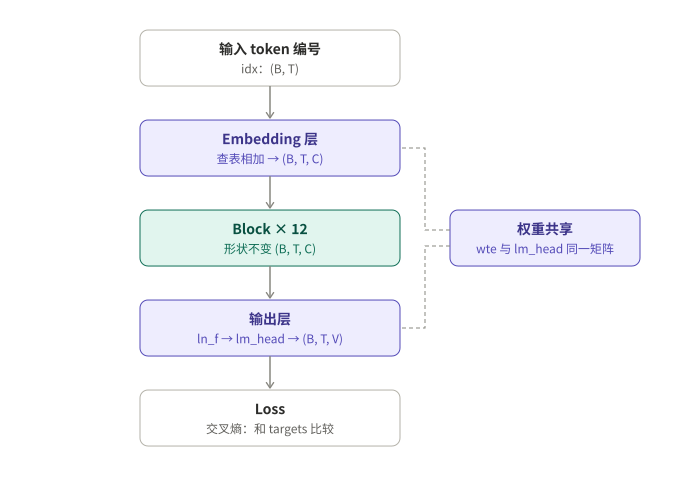
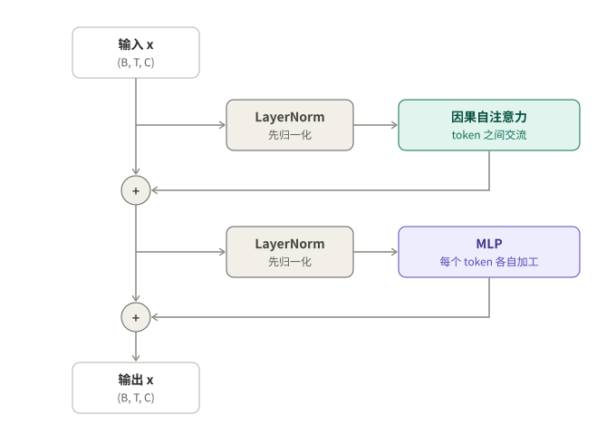
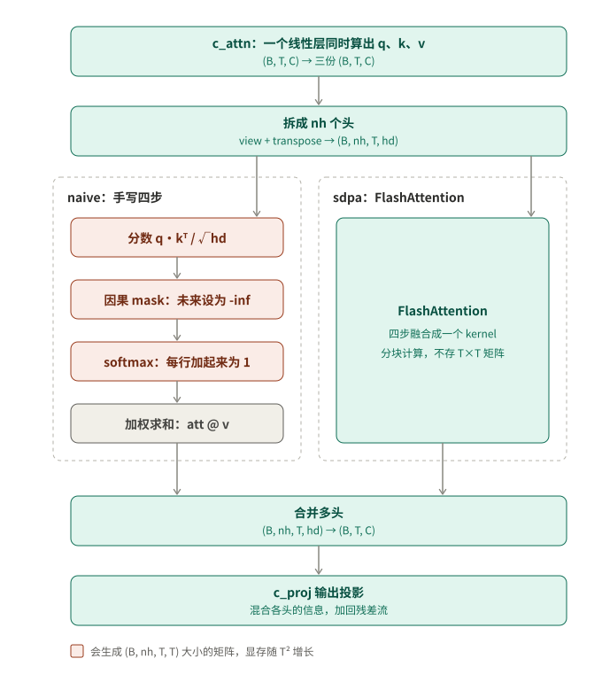

# model.py 详解

这份文档分三部分，建议按顺序读：

1. **流程框架**：先看三张图，了解数据从输入到 loss 是怎么流动的。
2. **每个部分是什么、干什么用**：用一句真实的句子，从头到尾走一遍模型。
3. **每个部分为什么这样设计**：每一步背后的原因、不这样做会怎样，以及和 AI Infra 的关系。

---

## 一、流程框架

### 整体数据流



token 编号先变成向量，经过 12 个 Block 加工，再由输出层给词表里每个词打分，最后和正确答案比较，得到 loss。Embedding 层和输出层共用同一张表（权重共享）。

### 一个 Block 的内部



左边的竖线是“残差流”。两个子层（注意力和 MLP）分别从它分出去计算，再把结果加回来。每个子层计算之前，都先做一次 LayerNorm。

### 因果自注意力的内部



中间分成左右两种实现，对应 `attn_impl` 这个性能开关。左边手写的四步里，前三步都会生成 T×T 的大矩阵；右边的 FlashAttention 把四步融合成一步，并且不保存这个大矩阵。

### 8 个部分

| # | 部分 | 代码位置 | 什么时候用到 |
|---|---|---|---|
| ① | 配置 | [`GPTConfig`](../model.py#L80)、[`MODEL_PRESETS`](../model.py#L101) | 造模型时，用一次 |
| ② | 输入层 | [`wte`](../model.py#L286)、[`wpe`](../model.py#L292) | 每次前向计算 |
| ③ | Block 骨架 | [`Block`](../model.py#L247) | 每次前向计算 |
| ④ | 因果自注意力 | [`CausalSelfAttention`](../model.py#L121) | 每次前向计算（在 Block 里面） |
| ⑤ | MLP | [`MLP`](../model.py#L221) | 每次前向计算（在 Block 里面） |
| ⑥ | 输出层与 loss | [`ln_f`](../model.py#L299)、[`lm_head`](../model.py#L304)、[`cross_entropy`](../model.py#L380) | 每次前向计算 |
| ⑦ | 初始化 | [`_init_weights`](../model.py#L315) | 造模型时，用一次 |
| ⑧ | 优化器 | [`configure_optimizer`](../model.py#L383) | 每一步训练的最后，更新参数 |

---

## 二、每个部分是什么、干什么用

下面拿一句真实的英文 **"The cat sat on the mat"**，让它从头到尾走一遍模型。

### ① 配置（GPTConfig）

**是什么**：一张**规格表**，就像买电脑时的配置单。

**干什么用**：告诉代码要造一个多大的模型。

| 配置项 | GPT-2 的值 | 大白话 |
|---|---|---|
| `vocab_size` | 50257 | 模型认识多少个词 |
| `block_size` | 1024 | 一次最多读多少个词 |
| `n_embd` | 768 | 每个词用多少个数字来表示 |
| `n_layer` | 12 | 有多少个加工站（Block） |
| `n_head` | 12 | 每个加工站里有几个人同时在“看”（注意力头） |

`tiny`、`gpt2` 这些预设，就是几张填好的规格表。

### ② 输入层（wte + wpe）：给每个词发“身份档案”和“座位号”

句子进来之前，分词器已经把它切成 token，并换成了编号：

| 词 | The | cat | sat | on | the | mat |
|---|---|---|---|---|---|---|
| 编号 | 464 | 3797 | 3332 | 319 | 262 | 2603 |

问题是，编号只是代号，模型没法拿 3797 去做计算。

**wte 是什么**：一张 **50257 行 × 768 列的大表格**，每个词占一行。每一行是这个词的**数字档案**，由 768 个数字组成，用来描述这个词的特征。

**wpe 是什么**：一张 **1024 行 × 768 列的表格**，每个位置占一行，相当于**座位号的档案**。

**干什么用**：把编号变成模型能计算的数字。以 "cat" 为例，为了好理解，假设每个档案只有 4 个数字：

```
cat 的档案（wte 第 3797 行）： [ 0.20, -0.50,  0.80,  0.10]
第 1 号座位（wpe 第 1 行）：   [ 0.01,  0.03, -0.02,  0.05]
相加，得到 cat 的输入向量：     [ 0.21, -0.47,  0.78,  0.15]
```

6 个词都这样处理，就得到 6 个向量，每个 768 维，也就是代码里的 **x，形状是 (6, 768)**。

### ③ Block：加工站

**是什么**：模型的主体是 **12 个加工站串成一条流水线**。每个加工站里有两道工序：先是**注意力**（词和词之间交流），然后是 **MLP**（每个词自己思考）。

**干什么用**：一站一站地修改每个词的向量，让它装进越来越多**上下文**的信息。

- 刚进来时，"sat" 的向量只代表 “sat 这个词本身”。
- 经过几站之后，它的向量里融进了 "The cat" 的信息，变成了 “猫坐下了”。
- 到了 "the" 这个位置，向量里已经装着 “猫坐在某个东西上”，模型才有可能猜出下一个词是 "mat"。

Block 里还有两个配角：

**残差连接是什么**：每道工序**不是把向量换成新的，而是在原来的向量上加一点修改**。好比改文章时做批注，而不是整篇重写，原来的内容一直都在。

**LayerNorm 是什么**：把每个词的 768 个数字**换算到统一的尺度**，让平均值是 0、波动大小是 1。好比把不同科目的考试成绩都换算成标准分。
**干什么用**：防止数字经过 12 站之后越算越大或越算越小。

### ④ 注意力（CausalSelfAttention）：词和词之间交流

**是什么**：让每个词**回头看它前面的词**，决定每个词看多少，再从中**拿走相应的信息**。

**干什么用**：一个词的意思取决于上下文。"sat" 本身不知道是谁坐下了，它得去前面找答案。

**以 "sat" 为例，看它怎么交流**（下面的数字是为了说明而假设的）：

1. **每个词准备三样东西**：这是 `c_attn` 做的事。
   - **Q（提问）**：sat 问：“谁坐下了？”
   - **K（标签）**：每个词举一个标签。The 举着“冠词”，cat 举着“名词、动物”，sat 举着“动词”。
   - **V（内容）**：被选中之后，这个词实际交出去的信息。
2. **打分**：拿 sat 的问题去和每个标签比对，问题和 cat 的标签最匹配，分数最高。
3. **遮住后面**（因果 mask）：sat 只能看 The、cat 和它自己，后面的 on、the、mat 被遮住。就像考试时把后面的答案盖住。
4. **把分数变成比例**（softmax）：比如 The 占 10%、cat 占 70%、sat 自己占 20%，三个加起来等于 100%。
5. **按比例混合内容**：

   ```
   sat 的新向量 = 10% × The 的内容 + 70% × cat 的内容 + 20% × sat 自己的内容
   ```

   于是 sat 的向量里有了 “是猫” 这条信息。

**多头是什么**：上面这套流程，同时有 **12 个人**各自独立做一遍，每个人关注的方面不一样。比如一个人找主语，一个人看前一个词，一个人检查标点。

**c_proj 是什么**：最后把 12 个人的结论**汇总**成一个向量，再加回原来的向量上。

### ⑤ MLP：每个词自己思考

**是什么**：一个两层的小神经网络。先把每个词的向量从 768 个数字**放大到 3072 个**，加工之后再**缩回 768 个**。

**干什么用**：注意力负责把信息**收集过来**，MLP 负责**消化和联想**，也就是结合模型学到的知识，推出新的信息。

比如到了 "the" 这个位置，注意力已经收集到 “猫”“坐”“在……上” 这些信息。MLP 会进一步联想：“接下来应该是一个能让猫坐上去的东西”。模型学到的大量常识（比如 “法国的首都是巴黎”）主要存在 MLP 里。

**打个比方**：注意力像**开会讨论**，大家互相交换信息；MLP 像**会后每个人回到自己的座位上独立思考**。

### ⑥ 输出层和 loss：猜答案、打分

**ln_f 是什么**：出流水线之前，最后做一次标准化（同 ③ 里的 LayerNorm）。

**lm_head 是什么**：一个**打分器**。它把每个位置上 768 个数字的向量，变成 **50257 个分数**，词表里每个词一个分。分数越高，说明模型越觉得这个词会是下一个。

比如在最后那个 "the" 的位置（假设的数字）：

| 候选词 | 分数 | 换算成概率 |
|---|---|---|
| mat | 8.2 | 35% |
| floor | 7.9 | 26% |
| bed | 7.1 | 12% |
| ……其余 5 万多个词 | | 合计 27% |

**权重共享是什么**：lm_head 打分时用的那张表，和 ② 里的 wte **是同一张表**，不需要另外再存一份。

**loss 是什么**：模型的**考试成绩，越低越好**。算法是看模型给**正确答案**多少概率，然后取负对数：

- 给正确答案 "mat" 35% 的概率 → loss = −ln(0.35) ≈ **1.05**
- 只给 0.01% 的概率 → loss ≈ **9.2**，说明错得很离谱

**干什么用**：**训练的唯一目标，就是把这个数降下来。** 反向传播从 loss 出发，算出每个参数该怎么调整。

一句话不止出一道题，而是**每个位置都出一道**，最终的 loss 是所有题目的平均分：

| 看到的内容 | 要猜的下一个词 |
|---|---|
| The | cat |
| The cat | sat |
| The cat sat | on |
| The cat sat on | the |
| The cat sat on the | mat |

### ⑦ 初始化：给模型一个起点

**是什么**：模型刚造出来时有 **1.24 亿个参数**，也就是 wte 表、各种线性层里的那些数字。初始化就是给它们**填上随机的小数字**，大多数在 −0.04 到 0.04 之间。

**干什么用**：训练就是从这个起点出发，一点一点地调整参数。起点选得合适，训练才能顺利开始。

刚初始化的模型什么都不懂，它给 5 万个词的概率都差不多，所以 loss ≈ ln(50257) ≈ **10.8**。在 RTX 4090 上的实验中，第一步的 loss 是 10.95，正好符合。

### ⑧ 优化器（AdamW）：真正动手改参数

**是什么**：负责**修改参数的执行者**。

**干什么用**：一步训练分两半：
- **反向传播**（`loss.backward()`）只负责算出**每个参数应该往哪个方向改、改多少**，也就是梯度。
- **优化器**（`optimizer.step()`）拿着梯度，**真正去修改那 1.24 亿个参数**。

打个比方：梯度是**导航**，告诉你往哪走；优化器是**司机**，决定实际踩多大油门。AdamW 会记住之前的路线（惯性），给每个参数单独决定步子迈多大，还会顺便把参数往 0 拉一点（weight decay），防止参数变得过大。

### 小结

| 部分 | 是什么 | 干什么用 |
|---|---|---|
| ① 配置 | 规格表 | 决定模型有多大 |
| ② 输入层 | 词的档案表 + 座位号表 | 把词的编号变成能计算的数字向量 |
| ③ Block | 12 个串起来的加工站 | 一站一站地给每个词补充上下文信息 |
| ④ 注意力 | 回头看前面的词，并按比例取信息 | 词和词之间交流 |
| ⑤ MLP | 每个词单独使用的小网络 | 消化收集到的信息，结合知识做联想 |
| ⑥ 输出层 + loss | 打分器 + 考试成绩 | 猜下一个词，并衡量猜得准不准 |
| ⑦ 初始化 | 给参数填随机初值 | 给训练一个合适的起点 |
| ⑧ 优化器 | 修改参数的执行者 | 根据梯度真正去更新参数 |

---

## 三、每个部分为什么这样设计

### ① 配置：为什么几个数字就能决定一个模型

- **为什么要把结构和规模分开？** GPT-2 系列有 124M、350M、774M、1.5B 四个大小，结构完全一样，只是层数和宽度不同。把“结构”写成代码、把“规模”写成数字，同一份代码就能造出不同大小的模型。后来的 scaling law（规模定律）研究也是这个思路：结构固定，只改规模，看效果怎么变化。
- **为什么做 Infra 的人要先看这几个数？** 参数量可以直接算出来：每个 Block 约 12 × C² 个参数，embedding 有 V × C 个。显存和算力的需求都由这几个数决定。比如 124M ≈ 12 层 × 12 × 768²（约 85M）+ 50257 × 768（约 38.6M）。
- **为什么每个头的维度是 64？** 太小的话，每个头用来做匹配的向量太短，能表达的关系太粗糙。太大的话，总宽度不变时头数就变少，能同时关注的关系也变少。64 和 128 是业界最常用的值，FlashAttention 等 GPU kernel 也专门针对这两个尺寸做了优化。
- **为什么词表大小是 50257？** GPT-2 用的是字节级 BPE 分词：
  - 256 个单字节，保证任何文本都能被编码，不会出现“未知词”。
  - 50000 个合并出来的词，让常见词只占一个 token，序列更短。
  - 再加 1 个结束符。

  词表大小本身是个取舍：词表越大，序列越短，attention 越便宜；但 embedding 和输出层也越大，输出层的 logits 就是显存大户之一。

### ② 输入层：为什么要把编号变成向量

- **为什么不能直接用编号计算？** token 编号是随意分配的。15496 和 15497 挨着，但对应的两个词可能毫无关系，编号的大小本身没有意义。查表把每个 token 变成一个可以学习的向量，训练过程中，意思相近的词会自动得到相近的向量。
- **为什么用查表，而不是矩阵乘法？** 数学上，查表等价于“one-hot 向量 × 矩阵”。但 one-hot 向量有 50257 维，只有一个位置是 1，真去做乘法会浪费 99.99% 的计算，所以直接取出对应的那一行。
- **为什么需要位置向量？** attention 本质上是对一组向量做加权平均，它不关心顺序：把输入打乱，每个 token 算出的结果只是跟着换了位置，值不变。没有位置信息，“狗咬人”和“人咬狗”在模型看来几乎一样。严格来说，因果 mask 会泄露一点位置信息，但很弱，不能依赖。
- **为什么是相加，而不是拼接？** 拼接会让向量变长，后面每一层都得跟着变大。相加能保持宽度 C 不变。768 维的空间足够大，模型可以自己学会把“内容”和“位置”放在不同的方向上，互不干扰。
- **为什么用可学习的绝对位置，代价是什么？** 这是 GPT-2 的做法，最简单，效果也不错。代价是序列长度不能超过 `block_size`：位置表只有 1024 行，第 1025 个位置根本没有对应的向量，`GPT.forward` 里那个 `assert` 就是因为这个。现代模型（比如 LLaMA）改用 RoPE，把位置编码成向量的旋转角度，表示的是 token 之间的相对距离，处理长序列时泛化更好。超长视频序列这类场景，位置编码怎么选就是关键问题之一。

### ③ Block 骨架：为什么要残差连接和 Pre-LN

**为什么要叠 12 个一模一样的 Block？**
- 每一层都在前一层的结果上再加工一次。层数越多，能组合出的特征越复杂。
- 所有 Block 结构相同，扩展规模时只需要改 `n_layer`。
- **Infra 视角**：结构相同的 Block 是天然的切分单位。流水线并行按 Block 把模型分到不同 GPU 上；FSDP 按 Block 切分参数；activation checkpointing 也以 Block 为单位重算。为什么选 Block 这个粒度？因为每个 Block 的输入只是一个 (B, T, C) 的张量，存起来很便宜，而 Block 内部的中间结果（包括 attention 矩阵）要大得多。

**为什么需要残差连接 `x = x + f(x)`？**
- **要解决的问题**：2015 年 ResNet 提出残差连接之前，网络一深就训练不动。这不是过拟合，而是加了层之后，连训练集上的效果都会变差。原因是梯度要逐层往回传，每经过一层就被乘一次，传到前面几层时已经接近 0，也就是“梯度消失”。
- **为什么加法能解决？** 对 `x + f(x)` 求导得到 `1 + f'(x)`。不管 `f` 学成什么样，那个“1”都保证梯度能原封不动地传到最前面。从优化的角度看，每一层只需要学一个“修正量”：什么都不学（`f = 0`）就等于保持原样，所以训练的起点非常安全。
- **残差流**：可以把 x 想成一条贯穿整个模型的“信息总线”，宽度始终是 C。每个 attention 和 MLP 都先从总线上读数据（经过 LayerNorm），算完再把结果加回总线。这就是为什么所有子层的输出都必须是 C 维。

**为什么要做 LayerNorm？**
- 向量每经过一层，数值的尺度都会变。几十层累积下来，数值可能越来越大（爆炸），也可能越来越小（消失）。
- LayerNorm 把每个 token 的向量拉回到均值 0、方差 1，再用两个可学习的参数让模型自己决定合适的尺度。

**为什么用 LayerNorm，而不是 BatchNorm？**
- BatchNorm 在一个 batch 的多个样本之间做统计，每个样本的计算结果会受到同 batch 里其他样本的影响。推理时 batch 常常只有 1，训练和推理的行为就不一致了。
- LayerNorm 只在每个 token 自己的向量内部做统计，和 batch 大小、序列长度都无关。

**为什么先归一化再进子层（Pre-LN）？**
- 原始 Transformer 用的是 Post-LN：`x = LN(x + f(x))`。LayerNorm 挡在残差主路上，梯度每经过一层都要穿过一次 LayerNorm。层数一多，训练就不稳定，只能靠非常小心的学习率 warmup 来维持。
- Pre-LN 写成 `x = x + f(LN(x))`，主路上没有任何东西挡着，梯度可以直接传过去。
- 代价是最后一个 Block 的输出从来没有被归一化过，所以模型末尾要补一个 `ln_f`。
- 现代模型（比如 LLaMA）用 RMSNorm，省掉了减均值这一步。效果差不多，计算更便宜。

### ④ 因果自注意力：每一步为什么这样做

**为什么用 attention，而不是 RNN？**
- RNN 必须一个 token 接一个 token 地处理：第 100 个 token 要等前 99 个算完，没法在时间维度上并行。而且第 1 个 token 的信息要传递 99 次才能到达第 100 个，一路上会逐渐丢失。
- attention 让每个 token 一步就能直接看到前面所有 token，距离永远是 1。所有位置还能同时计算，整个过程就是几次大矩阵乘法，正好是 GPU 最擅长的事。Transformer 能取代 RNN，与其说是因为效果更好，不如说是因为它和 GPU 的硬件特性高度匹配。
- 代价是每个 token 都要和所有 token 算一次，计算量和显存都是 O(T²)。

**为什么要分成 Q、K、V 三个？**
- 如果直接拿 x 和 x 做点积，分数矩阵是对称的：“A 关注 B”的程度永远等于“B 关注 A”。可语言里的关系常常不对称，比如动词需要找它的主语，主语却不需要找动词。而且每个 token 和自己的点积通常最大，它会主要关注自己。
- 分成三个投影后，三种角色就分开了：
  - Q：我在找什么
  - K：别人能通过什么找到我
  - V：被找到后，我提供什么内容

  用来匹配的信息（K）和实际传递的信息（V）可以完全不同。
- **为什么合并成一个 `c_attn`？** 纯粹是为了效率。三个投影的输入都是同一个 x，做一次大矩阵乘法比做三次小的更能把 GPU 跑满，x 也只需要从显存读一次。数学上完全等价。

**为什么要多头？**
- softmax 的结果往往集中在少数几个位置上，所以一组注意力权重基本只能表达“一种关系”。但一个词同时需要好几种信息：前一个词是什么、句子的主语是谁、引号有没有闭合……
- 多头让每个 token 同时拥有 12 组独立的注意力权重，分别关注不同的关系。
- **为什么是把 768 拆成 12 × 64，而不是做 12 个 768 维的头？** 拆分之后，总计算量和参数量与一个 768 维的单头完全相同。多头带来的多样性几乎不增加计算量。
- **Infra 视角**：各个头之间完全独立，所以张量并行（比如 Megatron）可以把不同的头分到不同的 GPU 上，计算过程中不需要互相通信。

**为什么要 `transpose` 成 (B, nh, T, hd)？** GPU 的批量矩阵乘法只在最后两维上做乘法，前面的维度都当作“批次”。把头数挪到前面之后，B 个样本 × 12 个头可以在一个 kernel 里一起算，不用循环 12 次。

**为什么用点积衡量相似度？** 点积计算最便宜，本质就是矩阵乘法。配合可学习的 W_q 和 W_k，`q·k = x W_q W_kᵀ x'ᵀ` 可以表达任意的双线性相似度。早期的加性注意力用一个小 MLP 来算相似度，表达能力差不多，但没法写成一次大矩阵乘法，速度慢得多。

**为什么要除以 √hd？**
- 假设 q 和 k 的每个分量都是方差为 1 的随机数，点积是 hd 个乘积之和，方差就是 hd。hd = 64 时，分数的标准差约为 8。
- softmax 对大数值非常敏感：分数之间相差 8 以上，结果就几乎变成 one-hot。在这种状态下，softmax 的梯度接近 0，模型学不动。
- 除以 √hd 之后，标准差回到 1 左右。为什么除的是 √hd 而不是 hd？因为方差和 hd 成正比，标准差和 √hd 成正比，我们要控制的是标准差。这样一来，不管每个头的维度怎么改，缩放都能自动适配。

**为什么需要因果 mask？**
- 这是一个提高训练效率的技巧：一条 1024 个 token 的序列，可以同时出 1024 道“预测下一个词”的题，一次前向计算全部做完。
- 但同时做题有一个问题：第 t 个位置要预测第 t+1 个词，而答案就在输入里。如果不把它挡住，模型只要学会“照抄下一个位置”，就能把 loss 降到 0，实际什么都没学到。
- 加了 mask 之后，并行计算的结果和“从左到右逐个预测”完全一致。这也保证了训练和生成时的行为一致，因为生成的时候本来就只能看到过去的 token。

**为什么在 softmax 之前填 -inf，而不是在 softmax 之后把权重设成 0？**
- 在 softmax 之前填 -inf，由于 e^(-inf) = 0，被挡住的位置权重恰好是 0，剩下的权重加起来仍然等于 1。
- 如果先做 softmax 再置 0，每一行的权重加起来就不到 1 了。而且未来 token 的分数已经参与了 softmax 分母的计算，信息还是泄露了进来。

**为什么用 softmax？**
- 它把任意大小的分数变成一组“全是正数、加起来等于 1”的权重。这样输出就是 V 的加权平均，不管序列多长，数值范围都很稳定。
- 它是一种“软”选择。如果直接挑分数最高的那个（argmax），这个操作没有梯度，模型没法学习。softmax 处处可导，同时分数最高的位置仍然拿到最大的权重。

**为什么最后还要 `c_proj`？**
- 各个头是独立算出来的。拼接之后，每个头的结果只占自己那 64 维，彼此没有交流。`c_proj` 把 12 个头的信息混合起来，再写回残差流。
- **Infra 视角**：Megatron 的张量并行正是利用了这个结构：`c_attn` 按列切分，每张卡负责几个头；`c_proj` 按行切分。整个 attention 只需要在最后做一次 all-reduce 通信。

**为什么同时保留 naive 和 sdpa 两种实现？**
- naive 版本要把 (B, nh, T, T) 的矩阵完整写进显存，再读出来做 softmax，再写回去、再读出来……显存占用和读写量都随 T² 增长。
- FlashAttention 采用分块计算，再加上“在线 softmax”（一边计算一边更新最大值和归一化分母），在 GPU 片上的高速缓存里一次完成全部四步。结果和 naive 版本完全一样，但从来不把完整的 T×T 矩阵写进显存。在 RTX 4090 上实测，换成它之后速度提升到 1.29 倍，显存少了 2.3 GB。
- 保留 naive 版本有两个原因：一是作为“标准答案”来对照，两者的 loss 完全相同；二是它把每一步都写得很清楚，适合学习。

### ⑤ MLP：有了 attention，为什么还需要 MLP

- **attention 擅长搬运，不擅长加工。** attention 的输出是 V 的加权平均，而 V 只是 x 的线性变换，整个过程中唯一的非线性只有计算权重时的 softmax。所以 attention 擅长“搬运信息”，也就是把相关 token 的信息拿过来，但不擅长对信息做加工。MLP 对每个 token 单独做非线性变换，负责从搬来的信息里算出新的特征。有研究发现，模型学到的大量事实知识主要存在 MLP 的参数里。
- **为什么先放大 4 倍？** 中间层的 3072 个神经元，可以理解成 3072 个“特征检测器”，层越宽，能识别的模式越多。4 倍是原始 Transformer 论文里的经验值，在效果和计算量之间比较平衡。代价是 MLP 占了每个 Block 约三分之二的参数和计算量。
- **为什么必须有激活函数？** 没有非线性的话，两个线性层相乘仍然只是一个线性层，放大 4 倍就白做了。
- **为什么用 GELU，而不是 ReLU？**
  - ReLU 在负数区域的梯度恒为 0。如果某个神经元的输入一直是负数，它就再也不会被更新，成了“死神经元”。而且 ReLU 在 0 点有一个硬拐角。
  - GELU 是平滑的，对较小的负数也保留一点输出和梯度，在 Transformer 上效果更好。
  - 用 tanh 近似版是 GPT-2 当年的选择，这里保留它是为了和原版完全一致。现代模型（比如 LLaMA）大多改用 SwiGLU。
- **为什么每个 token 单独计算？** 这是一种明确的分工：attention 负责 token 之间的交流，MLP 负责每个 token 自己的加工。单独计算意味着所有 token 可以完全并行，而且共享同一组参数。
- **Infra 视角**：“先放大、再缩回”的结构非常适合做张量并行。`c_fc` 按列切分，`c_proj` 按行切分，中间的 GELU 每张卡各算各的，整个 MLP 只需要通信一次。

### ⑥ 输出层与 loss：为什么共享权重，为什么用交叉熵

**为什么最后要有 `ln_f`？** 这是 Pre-LN 带来的代价。残差流经过 24 次累加，一次都没有被归一化过，数值尺度不确定。如果直接送进输出层，logits 的大小就不可控，所以要先归一化一次。

**为什么用一个线性层来打分？** 语言模型在每个位置上做的都是一个“从 50257 个词里选 1 个”的分类问题。这个线性层实际计算的是：隐藏向量和每个词的“词向量”做点积，越相似，分数越高。

**为什么输入层和输出层要共享权重？**
- **省参数**：这个矩阵有 3860 万个参数，占整个模型的 31%。
- **语义一致**：输入层的矩阵表示“每个词是什么意思”；输出层用点积判断“下一个词像不像某个词”。两边需要的都是“每个词的含义向量”，用同一套很自然。
- **对罕见词更友好**（更深一层的原因）：输入 embedding 的某一行，只有在对应的词出现在输入里时才会被更新，所以罕见词几乎学不到东西。而输出层的每一行在每一步都会收到梯度，因为 softmax 会给所有词都分配一点概率。共享之后，罕见词的向量也能通过输出层得到充分的训练。

**为什么用交叉熵作为 loss？**
- 交叉熵就是“模型给正确答案的概率”取负对数。最小化它，等价于让模型给真实出现过的文本分配尽可能高的概率，也就是最大似然估计。
- **为什么要取对数？** 一整段文本的概率是每个位置概率的乘积，取对数之后变成求和，数值稳定，计算也方便。而且对数对“非常自信地答错”惩罚很重：如果给正确答案的概率是 0.01，loss 是 4.6；如果概率是 0.0001，loss 就是 9.2。
- **梯度非常简洁**：softmax 加交叉熵，对 logits 的梯度就是“预测概率 − 正确答案的 one-hot”，不会出现梯度饱和的问题。
- **信息论的含义**：loss 表示“用这个模型来压缩文本，平均每个 token 需要多少信息量”。loss 越低，说明模型对语言的规律掌握得越好。
- **一个检验技巧**：刚初始化时，模型给每个词的概率差不多，loss 应该约等于 ln(50257) ≈ 10.82。
- **Infra 视角**：logits 的形状是 (B, T, V)，V 很大，所以它是显存大户之一。B=4 时，一个 fp32 的 logits 张量就有 0.8 GB。业界有专门的“融合交叉熵” kernel（比如 Liger Kernel），分块计算 loss，不需要完整保存 logits。

### ⑦ 初始化：为什么随机数要这样取

初始化要达到两个目标：一是数值经过 12 层之后，既不爆炸也不消失；二是模型一开始对所有词一视同仁，而不是上来就很自信地答错，导致巨大的 loss 和梯度。

- **为什么不能全部初始化为 0？** 如果全是 0，同一层的所有神经元会收到完全相同的梯度，更新之后仍然完全相同，永远学不出差异。这叫“对称性问题”，必须用随机数来打破对称。
- **为什么标准差取 0.02？** 这个值足够小，能让初始的 logits 都接近 0，softmax 接近均匀分布；又没有小到让信号消失。作为参照，能让方差逐层保持不变的经典取值是 1/√C = 1/√768 ≈ 0.036，0.02 是 GPT-2 实际采用的经验值。
- **为什么偏置初始化为 0？** 随机的权重已经打破了对称，偏置不需要再随机。0 是最中性的起点。
- **为什么残差分支的输出层要额外缩小 1/√(2 × 层数)？**
  - 残差流是一路累加起来的：embedding 加上 24 次增量（每层的 attention 和 MLP 各贡献一次）。
  - 如果每次增量的方差都是 σ²，全部加完后的总方差约为 24σ²，层数越多，总方差越大。
  - 把每次增量的标准差缩小到原来的 1/√24，方差就变成 σ²/24。加完 24 次之后，总方差仍然约为 σ²，和层数无关。
  - 这样，同一套初始化方案在 12 层和 48 层的模型上都能用。这是 GPT-2 论文里的做法。
- **为什么 LayerNorm 不用特别处理？** 它默认缩放为 1、偏移为 0，一开始就是纯粹的归一化，正好是我们想要的。

### ⑧ 优化器：为什么用 AdamW，参数为什么这样设

- **为什么用 Adam 系列，而不是 SGD？** Transformer 里不同参数的梯度大小差异很大，embedding、attention、LayerNorm 的梯度可能相差好几个数量级。SGD 对所有参数用同一个学习率，很难兼顾。Adam 为每个参数单独记录梯度的大小（v），并用它来调整更新步长，相当于每个参数都有自己的学习率。代价是每个参数要多存 m 和 v 两份状态，这正是“每个参数占 16 字节”的来源，也是 ZeRO 要解决的问题。
- **为什么用 AdamW，而不是 Adam 加 L2 正则？** 在 Adam 里，如果把正则项加进梯度，它会和梯度一起被除以 √v。结果是梯度越大的参数，受到的正则反而越弱，效果不一致。AdamW 把 weight decay 和梯度更新分开，直接对权重做衰减，每个参数受到的正则强度一样。
- **为什么只对二维及以上的参数做 weight decay？** weight decay 的目的是限制矩阵权重的大小：这些权重要和输入相乘，太大会让模型过度依赖某些特征。偏置和 LayerNorm 的缩放参数数量很少，几乎不会导致过拟合。而把 LayerNorm 的缩放往 0 拉，等于削弱整层的输出信号，这和归一化的目的相冲突。
- **为什么 β₂ 取 0.95，而不是默认的 0.999？**
  - β₂ 决定了 v 记住过去多少步的梯度大小：0.999 大约平均过去 1000 步，0.95 大约平均过去 20 步。
  - 如果梯度突然变大（比如遇到一个异常的 batch），用 0.999 时 v 反应太慢，还停留在“梯度很小”的状态，更新步长 m/√v 会突然变得很大，导致 loss 飙升。
  - 0.95 反应快得多，大模型训练因此更稳定。GPT-3 用的就是 0.95。
- **为什么提供 forloop、foreach、fused 三种实现？** 三者的数学计算完全一样，区别只在于在 GPU 上怎么执行。在 RTX 4090 上实测，fused 版本让每一步快了 6.5 毫秒，速度提升到 1.15 倍，原因是显存读写量从约 10 GB 降到了约 3.5 GB。

### 补充：为什么把性能开关做在模型内部，而不是写成两个模型

做对照实验时，每次只能改变一个变量。`attn_impl` 和 `act_ckpt` 只改变“怎么算”，不改变“算什么”。因果 mask 设置了 `persistent=False`，不保存进模型参数，所以两种实现的模型可以互相加载同一份权重。不同开关组合算出的 loss 也验证过完全相同。这样一来，实验结果里的速度差异只可能来自开关本身。

---

## 相关文档

- [每个实验改了代码的哪里](../README.md#每个实验改了代码的哪里)：11 组实验各自的开关，以及对应的代码行号
- [RTX 4090 实验结果与分析](../results/rtx4090/README.md)
