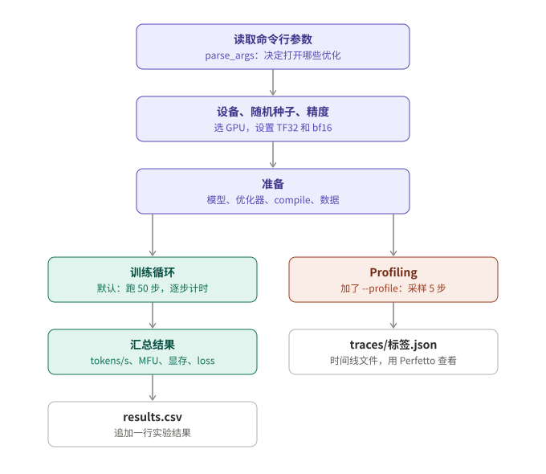
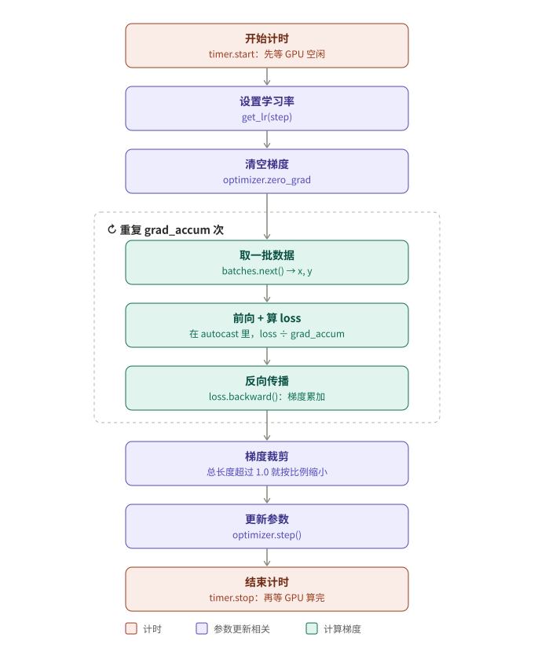
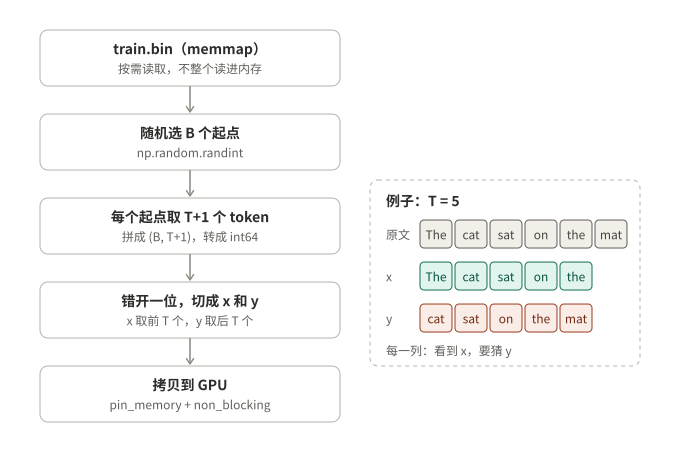

# train.py 详解

`model.py` 定义模型“算什么”，`train.py` 负责让模型跑起来，并测量它“跑多快”。

这份文档分三部分，建议按顺序读：

1. **流程框架**：先看三张图，了解运行一次 `python train.py` 时，代码依次做了什么。
2. **每个部分是什么、干什么用**：以实验 4（FlashAttention）为例，用它在 RTX 4090 上的真实日志，从头到尾走一遍。
3. **每个部分为什么这样设计**：每一步背后的原因、不这样做会怎样。

---

## 一、流程框架

### 整体流程



前三步是准备工作，只做一次。之后分成两条路：默认进入训练循环，跑 50 步并计时，最后把结果追加到 `results.csv`；加了 `--profile` 时，改为用 profiler 采样 5 步，导出一个时间线文件。

### 一步训练（train_step）



训练循环里的每一步，做的都是上图这件事。计时从“开始计时”到“结束计时”，中间就是一次完整的参数更新。虚线框里的三步会重复 `grad_accum` 次（默认 1 次）。

### 取一批数据（Batches）



每一步训练开始时，都从数据文件里随机取 B 段文本，错开一位切成输入 x 和答案 y。右边的例子说明了为什么要错开一位：每一列都是一道“看到 x、猜 y”的题。

### 10 个部分

| # | 部分 | 代码位置 | 什么时候运行 |
|---|---|---|---|
| ① | 命令行参数 | [`parse_args`](../train.py#L80) | 开始时，一次 |
| ② | 设备与随机种子 | [`pick_device`](../train.py#L126)、[随机种子](../train.py#L235) | 开始时，一次 |
| ③ | 精度设置 | [TF32](../train.py#L245)、[`autocast`](../train.py#L247) | 开始时设置；autocast 在每次前向时使用 |
| ④ | 准备模型和优化器 | [创建模型](../train.py#L269) 到 [`model.train()`](../train.py#L304) | 开始时，一次 |
| ⑤ | 数据读取 | [`Batches`](../train.py#L147) | 每一步 |
| ⑥ | 学习率调度 | [`get_lr`](../train.py#L321) | 每一步 |
| ⑦ | 一步训练 | [`train_step`](../train.py#L337) | 每一步 |
| ⑧ | 主循环与计时 | [训练循环](../train.py#L401) | 共 50 步 |
| ⑨ | 汇总与写结果 | [汇总](../train.py#L428)、[`append_result`](../train.py#L209) | 结束时，一次 |
| ⑩ | Profiling | [`run_profile`](../train.py#L460) | 只在加了 `--profile` 时 |

---

## 二、每个部分是什么、干什么用

下面以**实验 4（FlashAttention）**为例。`run_experiments.sh` 实际执行的命令是：

```bash
python train.py --model gpt2 --data shakespeare --steps 50 --skip_steps 10 \
    --batch_size 4 --tf32 --bf16 --compile --attn sdpa --tag 4_flash_attn
```

### ① 命令行参数（parse_args）

**是什么**：程序一开始，先读取命令里写的选项，存进 `args` 这个变量。

**干什么用**：决定这次实验的全部条件。实验 4 读完参数后是这样的：

| 参数 | 值 | 来源 |
|---|---|---|
| `args.tf32` | True | 命令里写了 `--tf32` |
| `args.bf16` | True | 命令里写了 `--bf16` |
| `args.compile` | True | 命令里写了 `--compile` |
| `args.attn` | `"sdpa"` | 命令里写了 `--attn sdpa` |
| `args.batch_size` | 4 | 命令里写了 `--batch_size 4` |
| `args.adamw` | `"foreach"` | 没写，用默认值 |
| `args.act_ckpt` | False | 没写，用默认值 |

像 `--tf32` 这种开关（`action="store_true"`），命令里写了就是 True，没写就是 False。

### ② 设备与随机种子

**是什么**：
- `pick_device` 决定用哪块硬件计算，顺序是 NVIDIA GPU、Apple 芯片、CPU，有哪个用哪个。
- 随机种子是给随机数生成器设定一个固定的起点。

**干什么用**：在服务器上，代码自动选到了 RTX 4090。随机种子固定为 1337 之后，每次运行时，模型初始化出来的参数一样，每一步取到的数据也一样。

### ③ 精度设置

**是什么**：决定计算时用多精确的数字。这里有两个开关：
- **TF32 开关**：fp32 的矩阵乘法要不要改用 Tensor Core，用稍低的精度换更快的速度。
- **autocast**：一个“计算区域”。写在 `with autocast():` 里面的计算，会自动改用 bf16（16 位数字）。`autocast()` 这个函数只是根据 `--bf16` 返回这个区域，或者返回一个什么都不做的区域。

**干什么用**：用低一点的精度换速度。实验 4 两个开关都打开了。

### ④ 准备模型和优化器

**是什么**：训练开始前的准备工作，按顺序做这些事：
1. 按配置造出模型（调用 `model.py` 里的 `GPT`），放到 GPU 上。
2. 预先算好几个数：参数量、每个 token 需要的计算量、显卡的峰值算力、显存估算。
3. 创建优化器。
4. 如果打开了 `--compile`，把模型交给 `torch.compile` 编译。
5. 切换到训练模式，创建数据读取器。
6. 打印一份配置表头。

**干什么用**：把训练需要的东西全部准备好。实验 4 打印出来的表头是：

```
设备        NVIDIA GeForce RTX 4090  (bf16 峰值 165 TFLOPS)
模型        gpt2  参数 124.4M  层数 12  隐藏维度 768  词表 50257
批次        B=4  T=1024  grad_accum=1  → 每步 4,096 tokens
开关        tf32=True bf16=True compile=True attn=sdpa adamw=foreach act_ckpt=False
估算        每 token 0.86 GFLOPs；参数+梯度+优化器状态 ≈ 1.85 GB
```

**torch.compile 是什么**：一个编译器，它会把模型的 Python 代码转换成更快的 GPU 程序。真正的编译发生在第一次计算时，所以实验 4 的第 0 步用了 **17.6 秒**，之后每步只要约 48 毫秒。

### ⑤ 数据读取（Batches）

**是什么**：一个“取数据的工具”。每调用一次 `next()`，它就从 `train.bin` 里随机取 B 段文本，切成 x 和 y，送到 GPU 上。

**干什么用**：给每一步训练提供输入 x 和答案 y。实验 4 中 B=4、T=1024，所以每次取出的 x 和 y 形状都是 (4, 1024)，数据来自 tiny shakespeare 的 304,223 个 token。

如果用 `--data synthetic`，就不读文件，直接在 GPU 上生成随机数当数据，专门用来测纯计算速度。

### ⑥ 学习率调度（get_lr）

**是什么**：一个函数，输入“现在是第几步”，输出“这一步的学习率”。学习率决定每一步参数改动的幅度。

**干什么用**：让学习率先升后降。50 步的训练里：
- 前 5 步（总步数的 10%）是 warmup，从 1.2e-4 线性升到 6e-4。
- 之后按余弦曲线慢慢降低，最后一步降到约 6e-5。

实验 4 日志里第 0 步显示 `lr 1.20e-04`，第 10 步显示 `lr 5.84e-04`，最后一步显示 `lr 6.07e-05`，和这条曲线完全对得上。

### ⑦ 一步训练（train_step）

**是什么**：完成“一次参数更新”的全部工作，也就是第二张图里的流程：设置学习率 → 清空梯度 → 取数据、前向、反向（重复 `grad_accum` 次）→ 梯度裁剪 → 更新参数。

**干什么用**：让模型学习一步。实验 4 中，每一步处理 4,096 个 token。函数返回三个值：这一步的 loss、梯度裁剪前的梯度大小（norm），以及学习率，用来打印日志。

### ⑧ 主循环与计时

**是什么**：把 `train_step` 重复 50 次，每次前后各计一次时，每 5 步打印一行日志。如果显存不够，就记录 OOM 并退出。

**干什么用**：测量训练速度。实验 4 第 10 步的日志是这样的：

```
step   10 | loss 6.8598 | lr 5.84e-04 | norm 1.54 |     48.3 ms |     84716 tok/s | MFU  43.9%
```

| 字段 | 含义 |
|---|---|
| `step 10` | 第 10 步 |
| `loss 6.8598` | 这一步的 loss，越低越好 |
| `lr 5.84e-04` | 这一步的学习率 |
| `norm 1.54` | 梯度的总大小（裁剪前），用来观察训练是否健康 |
| `48.3 ms` | 这一步花的时间 |
| `84716 tok/s` | 这一步的速度：4096 个 token ÷ 0.0483 秒 |
| `MFU 43.9%` | 用上了显卡理论算力的百分之几 |

### ⑨ 汇总与写结果

**是什么**：50 步跑完后，计算整体结果，打印出来，并追加一行到 `results.csv`。

**干什么用**：给这次实验一个最终成绩。实验 4 的结果是：

```
吞吐        84,502 tokens/s  （第 10 步之后的平均）
MFU         43.8%
峰值显存    4.16 GB  （其中参数+梯度+优化器状态约 1.85 GB，其余主要是激活值）
最终 loss   6.1441  （最后 10 步平均，用来确认优化没有改变训练结果）
```

### ⑩ Profiling（run_profile）

**是什么**：另一种运行模式。它不测平均速度，而是用 PyTorch 的 profiler 记录几步训练里，**每个算子各花了多少时间**。

**干什么用**：找出性能瓶颈。它会输出两样东西：
- 终端里一张表格，列出耗时最多的 15 个算子。
- `traces/标签.json` 时间线文件，用 https://ui.perfetto.dev 打开，可以看到 CPU 和 GPU 上每个操作的先后顺序和耗时。

### 小结

| 部分 | 是什么 | 干什么用 |
|---|---|---|
| ① 命令行参数 | 读取命令里的选项 | 决定实验条件 |
| ② 设备与随机种子 | 选硬件、固定随机数 | 自动用上 GPU，让每次运行可以重复 |
| ③ 精度设置 | TF32 开关和 bf16 计算区域 | 用低一点的精度换速度 |
| ④ 准备 | 造模型、建优化器、编译 | 把训练需要的东西准备好 |
| ⑤ 数据读取 | 取数据的工具 | 每一步提供输入 x 和答案 y |
| ⑥ 学习率调度 | 输入步数、输出学习率的函数 | 让学习率先升后降 |
| ⑦ 一步训练 | 一次完整的参数更新 | 让模型学一步 |
| ⑧ 主循环与计时 | 重复 50 次，每次计时 | 测量速度 |
| ⑨ 汇总与写结果 | 计算平均值并写进 CSV | 给实验一个最终成绩 |
| ⑩ Profiling | 记录每个算子耗时 | 找出瓶颈 |

---

## 三、每个部分为什么这样设计

### ① 命令行参数

- **为什么用开关，而不是每次改代码？** 每个实验都能用一行命令完整复现，`run_experiments.sh` 只要换开关组合就能批量运行。改代码容易改错，也很难保证不同实验之间只差了要比较的那一处。
- **为什么默认只跑 50 步？** 这里测的是“每一步有多快”，不是把模型训练好。跳过预热后，40 步的平均值已经足够稳定，多跑只会多花钱。
- **为什么要跳过前 10 步？** 前几步会做很多一次性的工作：初始化 CUDA、cuBLAS 挑选最快的矩阵乘法算法、显存分配器第一次申请内存，以及 `torch.compile` 编译。实验 4 的第 0 步用了 17.6 秒，正常的一步只要约 48 毫秒。如果把它算进平均值，实验 4 的速度会从 84,502 tokens/s 变成约 1 万，完全失真。
- **为什么要固定随机种子？** 不同实验的初始化参数和取到的数据都一样，loss 才能直接比较，用来确认“优化只改变了速度，没有改变训练结果”。

### ② 设备与随机种子

- **为什么自动选设备？** 同一份代码，在 Mac 上能用 CPU 或 MPS 做冒烟测试，在 GPU 服务器上自动用 CUDA，不需要改任何东西。
- **为什么要固定两个随机种子？** `torch` 的随机数用于模型初始化，`numpy` 的随机数用于选取数据的位置。只固定一个，另一个仍然每次不同。

### ③ 精度设置

**为什么要有 TF32 开关？**
- fp32 有 23 位尾数，TF32 只保留 10 位尾数。但两者的指数位都是 8 位，所以能表示的数值范围一样，只是精度低一些，对训练几乎没有影响。
- 好处是可以走 Tensor Core。RTX 4090 实测，矩阵乘法从 51.5 TFLOPS 提升到 84.1 TFLOPS。
- PyTorch 默认关闭它，是因为有些科学计算对精度很敏感。深度学习训练一般都可以放心打开。

**为什么是“混合”精度，而不是全部改成 bf16？**
- **权重必须用 fp32 保存。** bf16 只有 7 位尾数，大约只能精确到 3 位有效数字。一个大小为 0.02 的权重，在 bf16 里能表示的最小变化约为 0.0001。训练后期学习率衰减到 6e-5 左右时，很多参数的单步更新量比这个还小，在 bf16 里会被直接舍掉，参数就再也学不动了。所以权重本身和参数更新都保持 fp32。
- **对精度敏感的操作保持 fp32。** softmax 要算指数，数值很容易溢出；求和、求平均这类操作会不断累积舍入误差。autocast 会自动让这些操作用 fp32 计算。
- **计算量大的操作用 bf16。** 矩阵乘法占了绝大部分计算量，改用 bf16 后，4090 上实测能达到 153.7 TFLOPS。

**为什么用 bf16，而不是 fp16？** fp16 的指数位只有 5 位，数值范围小，梯度很容易下溢变成 0，必须配合“loss 缩放”（GradScaler）使用。bf16 的指数位和 fp32 一样是 8 位，不存在这个问题，用起来简单得多。

**为什么只把前向放进 autocast？** 反向传播会自动沿用前向时每一步的数据类型，不需要也不应该放进 autocast。这也是 PyTorch 官方推荐的写法。

**为什么要用 nullcontext？** 不开 bf16 时，返回一个什么都不做的区域，这样代码里统一写 `with autocast():` 就行，不用为开和不开写两套代码。

### ④ 准备模型和优化器

- **为什么要提前算好 FLOPs、峰值算力和显存估算？** 这些数在训练过程中不会变，算一次就够了。而且打印在日志开头后，日志本身就能说明这次实验的条件和预期。
- **为什么优化器用编译前的 `raw_model` 来创建？** 编译后的模型和原始模型共享同一份参数，所以训练效果完全一样。用原始模型更清楚，也能避免编译后参数名多出 `_orig_mod.` 前缀带来的麻烦。
- **为什么 `torch.compile` 能提速？**
  - 最主要的优化是“算子融合”。比如 GELU 和后面的加法，原本是两个 kernel，各自要从显存读一遍、写一遍数据；融合成一个 kernel 后，只需要读写一次。
  - 实验结果显示，baseline 里约 60% 的时间都花在这类“读写多、计算少”的操作上，所以融合的效果特别明显：实验 3 单项提速 1.83 倍。
  - 同时也减少了 Python 解释器的开销。
- **为什么编译结果会被缓存？** `torch.compile` 会把编译结果存在磁盘上。实验 6 的模型结构和实验 5 完全相同，所以第 0 步只用了约 2 秒，其他开了 compile 的实验要 17 到 23 秒。
- **为什么要调用 `model.train()`？** 它把模型切换到训练模式。这个模型里，`act_ckpt` 会根据它判断是否启用；Dropout、BatchNorm 这类层在训练和推理时行为不同，也靠它切换。

### ⑤ 数据读取

- **为什么 x 和 y 要错开一位？** 语言模型的任务是预测下一个词，答案直接来自文本本身，不需要人工标注，这叫“自监督学习”。一段长度为 T 的文本，同时提供了 T 道题。
- **为什么随机取，而不是按顺序读？** 实现最简单，每一步都是新的随机样本。这里只测速度，不需要严格按顺序把数据完整读一遍（epoch）。真正的大规模训练会把数据切成很多分片，按顺序读并打乱。
- **为什么用 memmap？** 它不会把整个文件读进内存，而是用到哪一段、操作系统才去读哪一段。数据集有几十 GB 甚至更大时也能这样用。
- **为什么文件里存 uint16，读出来又转成 int64？** GPT-2 的词表只有 50257 个词，小于 65536，所以每个 token 用 2 字节的 uint16 就能存下，比 int64 省 4 倍空间。但计算 loss 时，`cross_entropy` 要求答案必须是 int64，所以读出来之后要转换。
- **为什么要 `contiguous()`？** 切片得到的是原张量的“视图”，内存不连续。`model.py` 里会对答案调用 `.view(-1)`，它要求内存连续。
- **为什么要 pin_memory 和 non_blocking？**
  - 普通内存可能被操作系统换到硬盘上，GPU 不能直接读，要先复制到一块临时缓冲区，而且拷贝期间 CPU 只能干等。
  - `pin_memory()` 把数据放进“锁页内存”，GPU 可以直接读取；`non_blocking=True` 让 CPU 不用等拷贝完成，可以继续往下安排计算任务。
  - 这里每批数据很小，效果不明显。但在大规模数据管线里，这是防止 GPU 空等数据的基本手段。
- **为什么还提供随机数据（synthetic）？** 它完全没有读文件和拷贝的开销，测出来的是纯计算速度。拿它和真实数据的速度对比，就能判断数据读取是不是瓶颈：两者一样快，说明数据读取不拖后腿。

### ⑥ 学习率调度

- **为什么要 warmup？** 刚开始时参数是随机的，AdamW 对梯度大小的估计（v）只根据一两步的数据算出来，还很不准。这时用大学习率，很容易一步跨太远，训练直接发散。所以先从小学习率开始，慢慢升上去。
- **为什么要衰减？** 前期用大步长，loss 下降得快；后期用小步长，能更精细地收敛到更低的位置。余弦曲线让学习率平滑下降，最后停在最大值的 10%。
- **为什么手动设置学习率，而不用 PyTorch 自带的 scheduler？** 效果完全一样，但手动写更直观：每一步的学习率是多少，看 `get_lr` 一个函数就清楚了。

### ⑦ 一步训练

- **为什么每步都要清空梯度？** PyTorch 的梯度默认会累加，不清空的话，这一步的梯度会叠加在上一步上。`set_to_none=True` 直接把梯度设成 None，而不是填 0，可以省掉一次写显存的操作。
- **为什么需要梯度累积？** 更大的 batch 能让梯度更稳定，但显存放不下。梯度累积是分几次小 batch 算梯度、最后只更新一次参数，效果等于一个大 batch，显存却只需要一个小 batch 的量。比如 GPT-3 每一步要处理约 50 万个 token，单张卡根本放不下。
- **为什么 loss 要除以 `grad_accum`？** `cross_entropy` 算的是一个小 batch 内的平均 loss。如果直接把几个小 batch 的梯度加起来，梯度会大 `grad_accum` 倍。先除一下，累加之后正好等于“大 batch 的平均梯度”。
- **为什么记录 loss 时要 `detach()`，而且不调用 `.item()`？**
  - `detach()` 断开和计算图的联系。否则每一步的计算图都会一直被引用，没法释放，显存会越用越多。
  - `.item()` 会强制 CPU 等 GPU 算完，打断 GPU 的流水线。所以在循环里先把 loss 留在 GPU 上，计时结束之后再取出来。
- **为什么要做梯度裁剪？**
  - 偶尔会遇到一个“坏 batch”，算出特别大的梯度。如果照着更新，一步就可能把参数推到很糟糕的地方，loss 突然飙升。
  - 实验 4 第 0 步的梯度大小（norm）是 27.83。如果不裁剪，第一次更新的幅度会是正常情况的近 28 倍。裁剪后，梯度的总大小被限制在 1.0。
  - 函数返回的是裁剪**之前**的梯度大小。打印出来可以观察训练是否健康：刚开始时常常很大，之后会逐渐降到 1 左右（实验 4 第 10 步是 1.54）。

### ⑧ 主循环与计时

- **为什么计时前后都要 synchronize？** GPU 是异步执行的。Python 代码只是把计算任务“排进队列”，然后马上返回，并不会等 GPU 算完。如果不同步，测到的只是“排队花了多久”，而不是“GPU 实际算了多久”。`timer.start()` 和 `timer.stop()` 内部都会先等 GPU 把手上的任务做完。
- **为什么 `loss.item()` 放在计时结束之后？** `.item()` 会强制等待 GPU。放在计时之后，就不会影响测速结果。
- **为什么日志里既有单步速度，汇总时又算平均速度？** 单步速度用来观察过程，比如看出第 0 步在编译；平均速度更稳定，作为这次实验的最终成绩。
- **为什么在循环开始前重置显存峰值？** 这样统计到的峰值，只反映训练过程本身。
- **为什么要捕获 OOM，并把它记进 CSV？** 显存不够也是一种实验结果。实验 9 就是故意测试 batch 加到 32 会不会 OOM，结果表里能直接看到“这个配置跑不起来”。程序以退出码 1 结束，`run_experiments.sh` 会提示失败，然后接着跑下一个实验。

### ⑨ 汇总与写结果

- **为什么最终 loss 取最后 10 步的平均？** 单步 loss 波动很大，取平均更稳定。它的用途是比较不同实验的 loss 是否接近，确认优化没有影响训练结果。
- **为什么每次只追加一行到 CSV？** 每次运行都是独立的实验。只追加不覆盖，可以连续跑很多实验，最后用 `report.py` 统一汇总成表格。
- **为什么 CSV 里要记录配置列？** 只有结果、没有配置的话，过一段时间就不知道每一行是怎么跑出来的了。

### ⑩ Profiling

- **为什么 profiling 要单独作为一种模式，不在测速时顺便做？** profiler 本身会带来额外开销，开着它测出来的速度不准。所以测速和 profiling 分开进行。
- **为什么 profiling 之前也要先预热？** 确保 `torch.compile` 已经编译完成，不把编译时间混进分析结果里。
- **为什么同时记录 CPU 和 GPU 的时间？** 两边对比能看出瓶颈在哪里。如果 GPU 经常空闲、在等 CPU 下发任务，说明瓶颈在 CPU 端（比如 tiny 模型），这时 `torch.compile` 这类减少 Python 开销的优化最有用。
- **为什么按“self 时间”排序？** self 时间只算这个操作自己花的时间，不包括它内部调用的子操作。比如 `aten::linear` 内部会调用 `aten::addmm`，按总时间排序，同一段时间会被算两次。
- **wait、warmup、active 三个阶段分别是干什么的？**
  - wait：这一步完全不记录。
  - warmup：profiler 已经启动，但丢弃结果。profiler 刚启动时自身有额外开销，会让第一步的数据失真。
  - active：正式记录这 3 步。
- **为什么要 `record_shapes=True`？** 同时记录每个算子的输入形状，这样能分辨出是哪一个矩阵乘法，比如输出层 `lm_head` 的那个就特别大。

---

## 相关文档

- [model.py 详解](model_explained.md)：模型本身的流程图和设计原因
- [每个实验改了代码的哪里](../README.md#每个实验改了代码的哪里)：11 组实验各自的开关，以及对应的代码行号
- [RTX 4090 实验结果与分析](../results/rtx4090/README.md)
